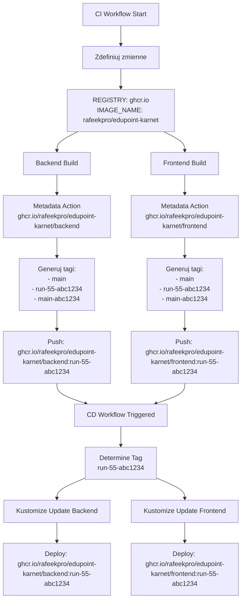

# 🐳 Przepływ nazw obrazów Docker w CI/CD

## 📍 Miejsca konfiguracji nazw obrazów

### 1️⃣ **CI Workflow** (`.github/workflows/ci.yml`)

#### Zmienne środowiskowe (linie 29-31):
```yaml
env:
  REGISTRY: ghcr.io
  IMAGE_NAME: ${{ github.repository }}  # np. "rafeekpro/edupoint-karnet"
```

#### Generowanie metadanych dla Backend (linie 71-80):
```yaml
- name: Extract metadata
  id: meta
  uses: docker/metadata-action@v5
  with:
    images: ${{ env.REGISTRY }}/${{ env.IMAGE_NAME }}/backend
    # Wynik: ghcr.io/rafeekpro/edupoint-karnet/backend
    tags: |
      type=ref,event=branch              # Tag: main, develop, etc.
      type=ref,event=pr                  # Tag: pr-123
      type=sha,prefix={{branch}}-         # Tag: main-abc1234
      type=raw,value=run-${{ github.run_number }}-{{sha}}  # Tag: run-55-abc1234
```

#### Generowanie metadanych dla Frontend (linie 141-150):
```yaml
- name: Extract metadata
  id: meta
  uses: docker/metadata-action@v5
  with:
    images: ${{ env.REGISTRY }}/${{ env.IMAGE_NAME }}/frontend
    # Wynik: ghcr.io/rafeekpro/edupoint-karnet/frontend
```

### 2️⃣ **CD Workflow** (`.github/workflows/cd.yml`)

#### Zmienne środowiskowe (linie 39-42):
```yaml
env:
  REGISTRY: ghcr.io
  IMAGE_NAME: ${{ github.repository }}  # "rafeekpro/edupoint-karnet"
  NAMESPACE: voucherskit-prod
```

#### Określanie tagu obrazu (linie 65-87):
```yaml
- name: Determine image tag
  id: determine-tag
  run: |
    if [ "${{ github.event_name }}" == "workflow_run" ]; then
      # Automatyczne uruchomienie po CI
      SHORT_SHA=$(echo "${{ github.event.workflow_run.head_sha }}" | cut -c1-7)
      echo "IMAGE_TAG=run-${{ github.event.workflow_run.run_number }}-${SHORT_SHA}" >> $GITHUB_OUTPUT
    elif [ -n "${{ inputs.image-tag }}" ]; then
      # Ręczne podanie tagu
      echo "IMAGE_TAG=${{ inputs.image-tag }}" >> $GITHUB_OUTPUT
    else
      # Domyślny tag
      echo "IMAGE_TAG=main" >> $GITHUB_OUTPUT
    fi
```

#### Deploy Backend (linie 231-248):
```yaml
# Budowanie URL obrazu (było źle - podwójne rafeekpro/edupoint-karnet)
IMAGE_URL="ghcr.io/rafeekpro/edupoint-karnet/backend:${{ steps.determine-tag.outputs.IMAGE_TAG }}"

# Aktualizacja obrazu w Kustomize
kustomize edit set image \
  ghcr.io/rafeekpro/edupoint-karnet/backend=ghcr.io/rafeekpro/edupoint-karnet/backend:${{ steps.determine-tag.outputs.IMAGE_TAG }}
```

## 🔄 Przepływ danych między CI a CD



## 🎯 Kluczowe elementy

### Format nazwy obrazu:
```
ghcr.io / OWNER / REPO / SERVICE : TAG
```

Przykład:
```
ghcr.io/rafeekpro/edupoint-karnet/backend:run-55-abc1234
│       │         │                │        │
│       │         │                │        └─ Tag (wersja)
│       │         │                └────────── Nazwa serwisu
│       │         └─────────────────────────── Nazwa repozytorium
│       └────────────────────────────────────── Właściciel (GitHub user/org)
└────────────────────────────────────────────── Registry (GitHub Container Registry)
```

### Generowanie tagów w CI:

1. **Branch tag**: `main`, `develop`
2. **PR tag**: `pr-123`
3. **SHA tag**: `main-abc1234`
4. **Run tag**: `run-55-abc1234` (tylko dla main branch)

### Przekazywanie tagu do CD:

1. **Automatyczne** (po CI):
   - CI kończy się sukcesem
   - CD uruchamia się automatycznie
   - Pobiera `run_number` i `head_sha` z eventu `workflow_run`
   - Rekonstruuje tag: `run-55-abc1234`

2. **Ręczne** (workflow_dispatch):
   - Użytkownik podaje tag w inputach
   - Lub używa domyślnego `main`

### Aktualizacja w Kubernetes (Kustomize):

```bash
# Komenda kustomize edit set image
kustomize edit set image \
  CURRENT_IMAGE_NAME=NEW_IMAGE_NAME:NEW_TAG

# Przykład:
kustomize edit set image \
  ghcr.io/rafeekpro/edupoint-karnet/backend=ghcr.io/rafeekpro/edupoint-karnet/backend:run-55-abc1234
```

## ⚠️ Poprzedni problem i rozwiązanie

### ❌ Problem (przed naprawą):
```yaml
env:
  IMAGE_NAME: ${{ github.repository }}  # "rafeekpro/edupoint-karnet"

# Później w kodzie:
IMAGE_URL="ghcr.io/${{ env.IMAGE_NAME }}/backend:tag"
# Wynik: ghcr.io/rafeekpro/edupoint-karnet/backend:tag ❌ (niepoprawny format)
```

### ✅ Rozwiązanie (po naprawie):
```yaml
# Zamiast używać zmiennej, wpisujemy bezpośrednio:
IMAGE_URL="ghcr.io/rafeekpro/edupoint-karnet/backend:tag"
# Wynik: ghcr.io/rafeekpro/edupoint-karnet/backend:tag ✅ (poprawny format)
```

## 📝 Ważne uwagi

1. **GitHub repository** (`${{ github.repository }}`) zawiera format `owner/repo`
2. **Docker image w GHCR** wymaga formatu: `ghcr.io/owner/repo/image:tag`
3. **Kustomize** wymaga pełnej nazwy obrazu po obu stronach `=`
4. **Tag musi być identyczny** między CI (push) a CD (pull)

## 🔧 Debugging

Jeśli deployment nie działa, sprawdź:

1. **Czy obraz istnieje w registry:**
   ```bash
   docker pull ghcr.io/rafeekpro/edupoint-karnet/backend:run-55-abc1234
   ```

2. **Czy tag jest poprawny:**
   ```bash
   # W CD workflow
   echo "IMAGE_TAG: ${{ steps.determine-tag.outputs.IMAGE_TAG }}"
   ```

3. **Czy Kustomize poprawnie aktualizuje:**
   ```bash
   kustomize build . | grep image:
   ```

4. **Czy Kubernetes może pobrać obraz:**
   ```bash
   kubectl describe pod <pod-name> -n voucherskit-prod
   ```